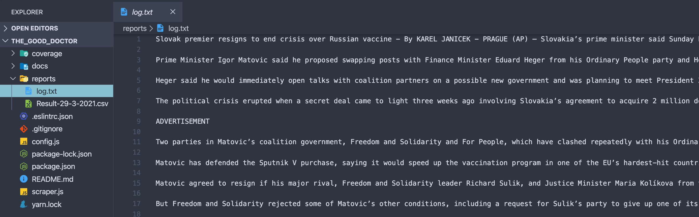
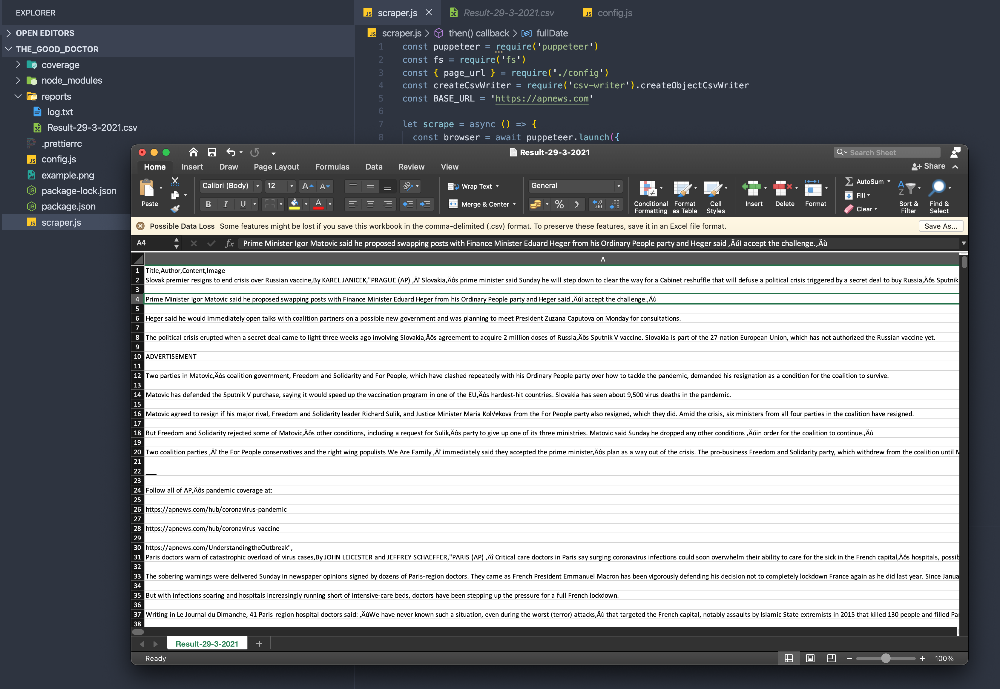

# The Good Doctor 
### Web scraper to get medical news using puppeteer

The aim of this project is to gather information regarding [health news](https://apnews.com/hub/health), centralizing and organizing this data quickly and simply.

### Tools

This project uses [Puppeteer](https://pptr.dev/) as a tool to perform interactions with the browser and collect data of interest

[Puppeteer](https://pptr.dev/) is a Node library which provides a API to control Chromium over the DevTools Protocol.

This type of script can assist in verifying the functioning of links, and in validating the presence of content, images, texts, and any other desired information.

### Setup

- You need to have [JavaScript](https://developer.mozilla.org/pt-BR/docs/Web/JavaScript) installed

* Use [npm](https://www.npmjs.com/) ***or*** [yarn](https://yarnpkg.com/) to handle JavaScript and Libraries versions

* Install npm

            $ npm install -g npm

* Install puppeteer

            $ npm install puppeteer

**Settings**

## Structure

```javascript
├── README.md
├── config.js
├── coverage
├── docs
│   ├── csv_file.png
│   ├── csv_report.png
│   └── the_good_doctor.png
├── package-lock.json
├── package.json
├── reports
│   ├── Result-29-3-2021.csv
│   └── log.txt
├── scraper.js
└── yarn.lock
```

**Execution**


To run the ***scraper***, use:

``
$ node scraper.js
``

### Reports

You can consult the logs during the exception, generated in a `.txt` file:



The result of the collected data is saved in a `.csv` file at the end of the run:



### To do

  - [ ]  Attach screenshots into report
  - [ ]  Improve common helpers and methods
  - [ ]  Extract settings to an `.yml` or `env` file

### Contributing

1. Clone the project: `git clone git@github.com:glautonvieira/the_good_doctor.git`
2. Create a branch for your functionality: `git checkout -b your-branch-name`
3. Commit your changes: `git commit -am 'Your descriptive commentary'`
4. Push the branch: `git push origin your-branch-name`
